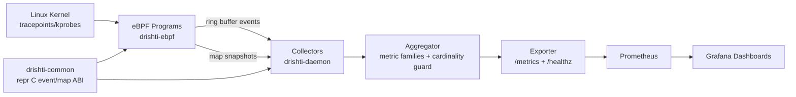

Drishti uses a layered model: shared ABI types, kernel probes, daemon collectors, aggregation, and exporter.

## Workspace Contracts

- `drishti-common`: `#[repr(C)]` shared event/map structs.
- `drishti-ebpf`: kernel-side programs with bounded maps and verifier-safe logic.
- `drishti-daemon`: loader, collectors, aggregation, and HTTP exporter.
- `xtask`: build helper path for eBPF artifacts.

## Runtime Guarantees

- partial probe attach failures are non-fatal and explicitly logged
- metrics stay prefixed with `drishti_`
- high-cardinality series are dropped and counted via `drishti_series_dropped_total`
