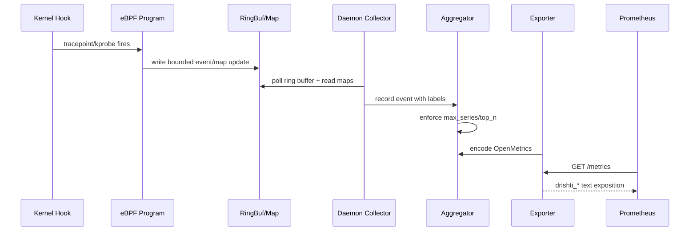

This sequence shows the end-to-end telemetry path from kernel event to scrape.

## Collector Isolation

Collectors run as independent tasks, so one noisy source does not block all telemetry.

## Health Contract

`GET /healthz` returns `200` while the exporter loop is active.
