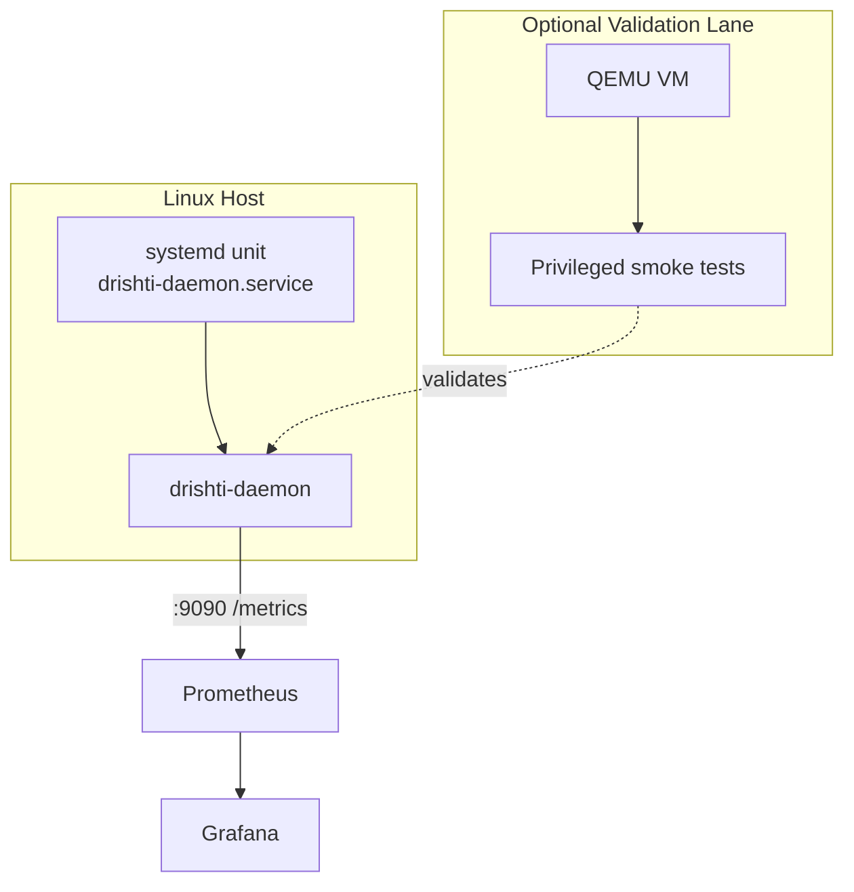

Drishti is designed to run with least privilege while still supporting eBPF attach where allowed.

## Capability Model

- privileged eBPF path: requires kernel features and attach permissions
- unprivileged test path: synthetic events + procfs collector for deterministic CI
- systemd hardening: capability bounding and filesystem restrictions in unit config

## Deployment Topology

## Safety Controls

- bounded map capacities in eBPF programs
- best-effort attach with explicit warnings
- config-level collector toggles for overhead control
- syscall `top_n` collapse to reduce label explosion
